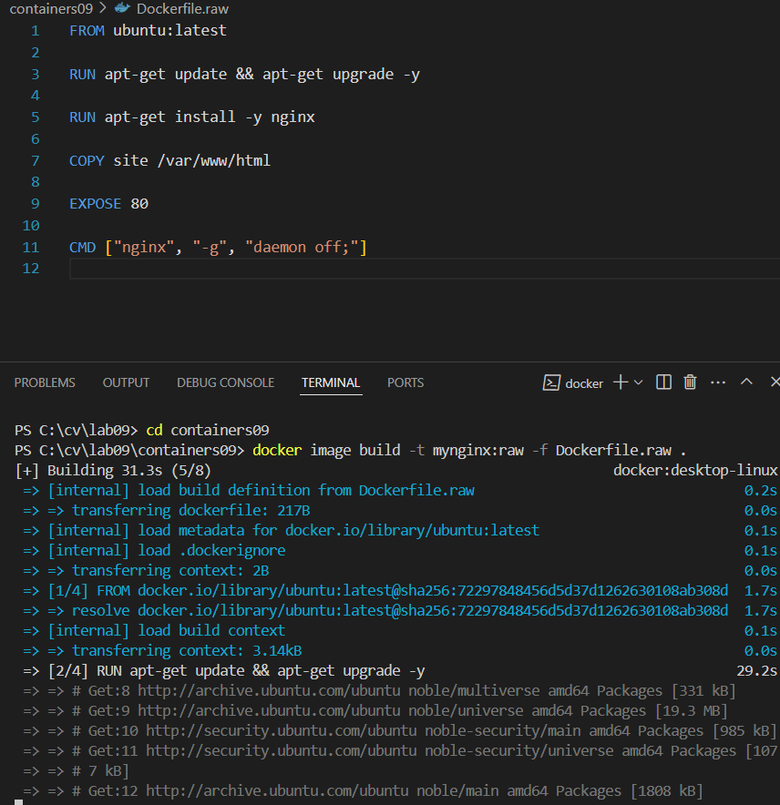
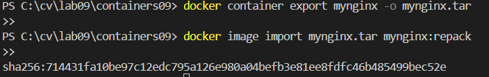
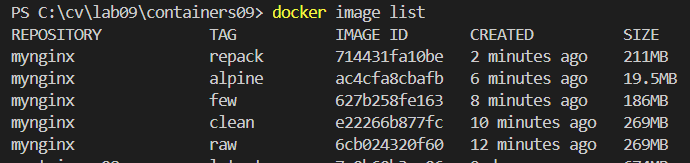
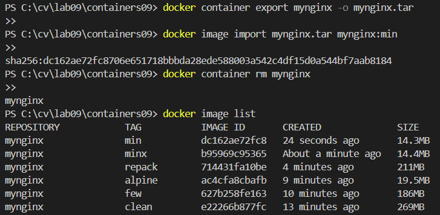

# Optimizarea imaginilor Docker
# Scop 
Familiarizarea cu metodele de optimizare a imaginilor Docker.

# Sarcina
Compararea diferitelor metode de optimizare a imaginilor:

- Ștergerea fișierelor temporare și a dependențelor neutilizate
- Reducerea numărului de straturi
- Utilizarea unei imagini de bază minime
- Reambalarea imaginii
- Utilizarea tuturor metodelor

# Realizarea lucrarii
1. am creat containers09, subdirectoriul site unde am adaugat pagina
2. am creat fisierul dockerfile.raw cu datele necesare si am construit imaginea:

3. am creat dockerfile.clean si am creat imaginea.
4. am creat dockerfile.few si dockerfile.alpine si am construit imaginea pentru ambele.
5. pentru repachetarea imaginii: intai am creat container cu numele mynginx, dupa care am facut export in fisier .tar si dupa l-am reimpachetat.

6. am creat fisierul docker.min cu datele necesare, am creat imaginea, am creat containerul, i-am facut export in fisier .tar, dupa import.
7. verificam dimensiunea maginilor.

# Raspuns la intrebari:
1. dupa parerea mea, utilizarea unei imagini de bază minime, cum ar fi alpine, este adesea cea mai eficientă, deoarece reduce semnificativ dimensiunea imaginii și are o suprafață de atac mai mică.
2. Dacă curățirea cache-ului se face într-un strat separat, Docker va păstra acel strat în cache.
3. Repachetarea imaginii presupune crearea unei noi imagini dintr-un container existent, folosind comanda docker container export și docker image import, ceea ce poate reduce dimensiunea imaginii prin eliminarea unor date redundante.

# Concluzie
Lucrarea a avut ca scop familiarizarea cu diverse metode de optimizare a imaginilor Docker, demonstrând impactul acestor tehnici asupra dimensiunii și performanței imaginilor. Toate metodle folosite au evidențiat importanța fiecărei abordări în reducerea dimensiunii finale a imaginii. Utilizarea tuturor metodelor combinate a dus la obținerea unei imagini de dimensiuni semnificativ mai mici, ceea ce poate contribui la îmbunătățirea eficienței în mediile de producție și la reducerea resurselor consumate.